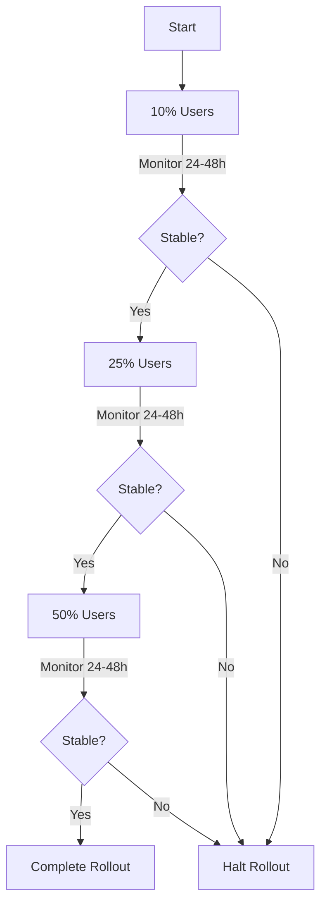

# Google Play Console Deployment

## 1. Initial Setup

### Store Listing Requirements

Required assets and information:

- **Visual Assets**
  - App icon (512x512 PNG)
  - Feature graphic (1024x500 PNG)
  - Phone screenshots (minimum 2)
  - Tablet screenshots (if supporting tablets)

- **Text Content**
  - App title (50 characters)
  - Short description (80 characters)
  - Full description (4000 characters)
  - Application type and category
  - Content rating questionnaire
  - Privacy policy URL

### Release Types

<CodeGroup>

```md Internal Testing
- For team members only
- Fastest review process
- Immediate updates
- Add testers via email addresses
```

```md Closed Testing
- Limited group of external testers
- Can be multiple tracks
- Requires basic store listing
- Testing feedback collection
```

```md Open Testing
- Available to all Play Store users
- Requires full store listing
- Useful for beta testing
- Public feedback enabled
```

```md Production
- Full public release
- Complete store listing required
- Longest review process
- Staged rollout recommended
```

</CodeGroup>

## 2. App Release Process

### Internal Testing Release

1. Navigate to "Testing > Internal testing"
2. Create new release:
   ```
   New Release > Create Release
   ```
3. Upload AAB file:
   - Drag and drop or browse for file
   - Wait for processing
   - Review warnings/errors

### Release Notes Template

```markdown
What's New in Version X.Y.Z:

🚀 New Features:
- Feature 1
- Feature 2

🐛 Bug Fixes:
- Fix 1
- Fix 2

🔧 Improvements:
- Improvement 1
- Improvement 2

Known Issues:
- Issue 1 (workaround if available)
```

### Production Release Strategy

#### Staged Rollout Process



#### Monitoring Metrics

Key metrics to track during rollout:
- Crash rate
- ANR rate
- User feedback
- Rating changes
- Performance metrics

## 3. Post-Release Tasks

### Monitor Analytics

Important metrics to track:
- Daily active users (DAU)
- Monthly active users (MAU)
- Retention rates
- Crash-free users
- Rating and reviews

### Crash Monitoring

```dart
// Example Firebase Crashlytics integration
void main() async {
    WidgetsFlutterBinding.ensureInitialized();
    await Firebase.initializeApp();

    // Pass all uncaught errors to Crashlytics
    FlutterError.onError = FirebaseCrashlytics.instance.recordFlutterError;

    runApp(MyApp());
}
```

### User Feedback Management

Best practices for handling user feedback:

| Task | Frequency | Action Items |
| --- | --- | --- |
| Review Monitoring | Daily | Check new reviews and ratings |
| Response Time | Within 24h | Respond to negative reviews |
| Issue Tracking | Weekly | Document common issues and patterns |
| Update Planning | Monthly | Plan updates based on feedback trends |